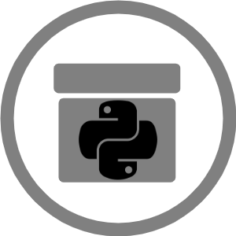

# containerimage-py

A python library for ineracting with container images and container image registries

## Installation

### Using Pip

> IMPORTANT: This project has not yet been released on PyPi.  This will not work at this point in time.  Instead follow [the local install instructions](#installation).

Run the following command to install the latest version of this package

```
pip install containerimage-py
```

### Local Install

1. Clone this repository
2. [Build the project from source](#build)
3. Locate the `.whl` (wheel) file in the `dist` folder
    - It should be named something like so: `containerimage_py-0.1.0-py3-none-any.whl`
4. Run the following command from the root of the repository, replacing the name of the `.whl` file if necessary
    ```
    pip install dist/containerimage_py-0.1.0-py3-none-any.whl
    ```

## Build

From the root of this repository, execute
```sh
make build
```

Under the hood, this will execute `python3 -m build` and produce a `.whl` (wheel) and `.tgz` (TAR-GZip archive) file in the `dist` subdirectory.
